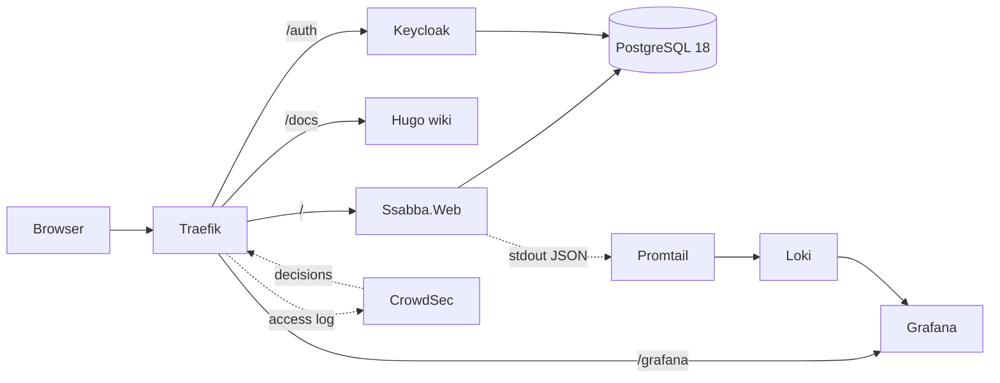

# Ssabba

Ssabba is a self-hostable tracker for beach volleyball. Players, teams, matches, set scores — and the
ladder that comes out of them.

> Status: early. The base stack is in place (app, database, sign-in, wiki, reverse proxy, logging); the
> feature set is deliberately small.

## Stack

| Layer          | Choice                                                      |
| -------------- | ----------------------------------------------------------- |
| App            | .NET 10 Blazor Web App, **Auto** interactivity              |
| Database       | PostgreSQL 18 via EF Core                                    |
| Sign-in        | Keycloak (OIDC), server-side token handling                  |
| Reverse proxy  | Traefik v3 with Let's Encrypt                                |
| Protection     | CrowdSec + Traefik bouncer plugin                            |
| Logs           | Serilog compact JSON → Promtail → Loki → Grafana             |
| Wiki           | Hugo (`hugo-book`), served at `/docs`                        |



## Quick start (self-hosting)

```bash
git clone --recurse-submodules https://github.com/OWNER/ssabba.git
cd ssabba/deploy
cp .env.example .env
$EDITOR .env          # APP_DOMAIN, ACME_EMAIL, and every change-me secret
docker compose -f compose.yaml up -d --build
```

Then open `https://APP_DOMAIN/`. The wiki is at `/docs`, sign-in at `/auth`, dashboards at `/grafana`.
Database migrations are applied on startup, so upgrading is `docker compose pull && docker compose up -d`.

After the first start, issue the CrowdSec bouncer key and put it in `.env`:

```bash
docker compose exec crowdsec cscli bouncers add traefik
```

The wiki has the [full self-hosting guide](docs/content/self-hosting/_index.md).

## Development

```bash
dotnet build Ssabba.slnx
dotnet test  Ssabba.slnx

cd deploy && docker compose up -d        # compose.override.yaml adds dev conveniences
```

`deploy/compose.override.yaml` publishes each service on localhost and runs Keycloak in dev mode. Add

```
127.0.0.1 keycloak
```

to `/etc/hosts` so the browser and the app container agree on the issuer URL.

See [docs/content/development](docs/content/development/_index.md) for project layout, render modes and
the migration workflow.

## Repository layout

```
src/Ssabba.Domain          entities and rating maths
src/Ssabba.Shared          DTOs shared with the WebAssembly client
src/Ssabba.Infrastructure  EF Core DbContext, configurations, migrations
src/Ssabba.Web             Blazor host, API endpoints, authentication
src/Ssabba.Web.Client      components that can run in WebAssembly
tests/                     xUnit tests
docs/                      Hugo wiki (also the user documentation)
deploy/                    Compose stack and service configuration
```

## Licence

[GNU AGPL-3.0](LICENSE). If you run a modified Ssabba as a service, the modifications stay available to
its users.
