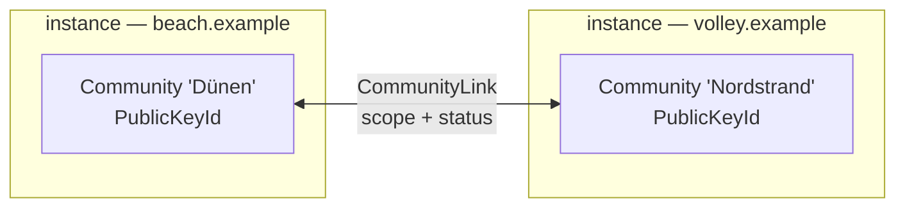

# The concept

Ssabba tracks the beach volleyball a group of people plays together: who turned up, who played with
whom, what the sets ended, and the ladder that follows from all of it. The group is the point. A
rating means something because everyone in it plays everyone else; it means very little compared to
a stranger on another beach.

## One instance, one community

A **community** is that group — a club, a regular Tuesday round, a beach. It is the unit of
ownership in the data model: almost every table carries a `CommunityId`, and the community owns its
venues, seasons, sessions, matches, ledger and equipment.

One instance is for one community. You self-host for your club; the first person to sign in is sent
to a short setup form, names the community and becomes its owner. Everyone who signs in after that
joins it as a member. Nothing in the app asks you to think about communities after that, because
there is nothing to ask: an instance resolves *the* community, and an instance holding a second one
is a broken instance that says so rather than quietly picking one.

The way two groups meet is **federation** — a `CommunityLink` between two instances, each still
owning its own data — not two communities sharing a database.

The schema does permit several, and the reasons it is not a supported deployment are worth knowing:

- There is no tenancy framework: no tenant middleware, no global query filter. Isolation is every
  query filtering by `CommunityId` itself, and every write refusing to mix communities — the way
  `MatchQueries` rejects a match whose two teams belong to different communities. A query that
  forgets is a leak, not a compile error.
- Ratings are per membership and not comparable between communities (see below), so a combined
  ladder across two communities on one instance does not exist and would not be meaningful.

`CommunityVisibility` controls discoverability: `Private` (invite only, unlisted), `Unlisted`
(reachable by direct link) or `Public` (listed, open to join requests).

## The rating belongs to the membership

`CommunityMember` — a player's presence inside one community — carries `Rating` and
`RatingDeviation`. `Player` carries no rating at all. The same person can be the strongest server
in one group and a newcomer in another, and both are true at once. This is what makes several
communities coherent side by side, and it is also the reason a rating cannot simply travel between
them. See [Identity and communities]().

## The group's life, not a network

A community owns more than its fixtures and its books. It has rules that have nothing to do with
volleyball — who may bring a guest, what happens to the ball money, how people speak to each other —
and it has ways of recognising people that the ladder cannot express. Both are community-scoped for
the same reason the rating is: they mean what *this* group says they mean. A `CommunityRuleDocument`
is versioned and may require acceptance; a `Badge` is defined and awarded inside one community and
does not travel.

The social surfaces are kept deliberately thin. Reactions attach to a match, a session, a photo or a
poll and are read there; a share link is a read-only window onto one of them for someone with no
account. There is no feed, no follower graph and no messaging — the group is the point, and every
group already has somewhere to chat. Safety is the part that is not optional: blocking is
player-to-player and instance-wide, reports go to a queue, and feedback can be genuinely anonymous.
None of it may rewrite the ladder, which stays a factual record of games played.

The evening itself is the one part of a club's life that is not administration, and it is where the
app has to earn its place: fifty people, five nets, and one person deciding who plays next for two
hours. Ssabba proposes and records there; it never allocates a court by itself, and it works for a
group where only the organiser is holding a phone. See [Game day]().

Discovery is the one surface that looks outward, and it is opt-in. Because a rating means nothing
outside its community, discovery filters on a coarse self-declared band instead.

See [Experience]() and
[ADR-0003]().

## A network of communities

Clubs are not islands. People move between beaches, tournaments draw entries from several groups,
and two clubs a town apart may want to share a court calendar. The plan is to let communities on
**different instances** link into a network, without a central server and without either side
handing over its data wholesale.

The identifiers for this already exist in the schema, so that adopting federation later does not
mean rewriting tables:

- Every community has a **`PublicKeyId`**, assigned once and never reused. It survives a rename, so
  a link does not break when a club changes its name.
- A **`CommunityLink`** records the other side: its `TargetCommunityUri` (the remote instance's
  community address, e.g. `https://beach.example/c/duenen`) and, once a handshake confirms it, its
  `TargetPublicKeyId`. Both sides present a shared secret when they talk; only its hash is stored.
- A link has a **scope** — `SharedTournaments`, `SharedCourts` or `Full` — so linking is not
  all-or-nothing.
- A link has a **lifecycle**: `Proposed → Active`, and `Suspended` or `Revoked` at any time by
  either side. Linking is consent between two communities, not a property of the instance.

**Nothing consumes any of this yet.** There is no protocol, no endpoint and no UI; the rows would
be inert if you created them. What exists is the shape, deliberately fixed early. The reasoning is
in [ADR-0002](), which also names the questions
still open — chiefly whose rating applies when players from two communities meet (issue #43). The
protocol itself is issue #42.
