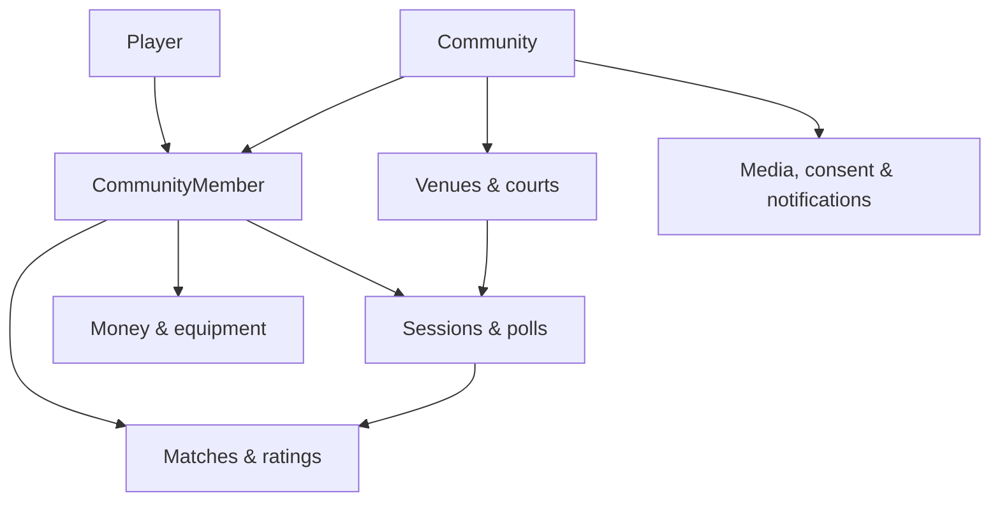

# Data model

Everything Ssabba stores lives in one PostgreSQL database, described by entities in
`src/Ssabba.Domain/Entities` and mapped by `IEntityTypeConfiguration`s in
`src/Ssabba.Infrastructure/Configurations`. The diagrams below are drawn from those configurations.

## The shape of it

A **community** is the unit of ownership: almost every table carries a `CommunityId`. A
**community member** is a player's presence inside one community, and it is that membership — not
the player — that holds the rating, casts votes, owes dues and organises sessions. An instance
normally runs a single community; see [Concept]() for what that means and
what changes if you run several.

## Conventions

- **Keys** are `Guid`, generated as version 7 (`Guid.CreateVersion7()`) so they sort by creation
  time. Two join tables use a composite key instead: `TeamMember` and `MediaSubject`.
- **Enums** are stored as `int`. There are no `HasConversion` calls, so the numeric values are part
  of the schema — append to enums, never reorder them.
- **Money** is always a pair: `long …AmountMinor` (cents) plus a fixed-length `char(3)` ISO
  currency code. No decimals, ever.
- **Soft delete** is a nullable `DeletedAt` on `Player`, `Match`, `Session` and `MediaAsset` only.
  There is no global query filter — queries must exclude deleted rows themselves.
- **Uniqueness** is frequently partial: a unique index with a `WHERE` clause, e.g. one current
  season per community, one outstanding loan per equipment item.
- **Delete behaviour** encodes intent. `Cascade` for things owned by their parent, `SetNull` for
  optional references, `Restrict` for anything the books or the ladder depend on.

## Pages

- **[Identity and communities]()** — players, memberships,
  invites, seasons.
- **[Venues and sessions]()** — courts, reservations, sessions,
  attendance, polls.
- **[Matches and ratings]()** — teams, matches, sets,
  appearances, tournaments.
- **[Operations and money]()** — the ledger, dues, funding,
  equipment, service requests.
- **[Privacy and notifications]()** — media, consent,
  audit, the notification outbox.
