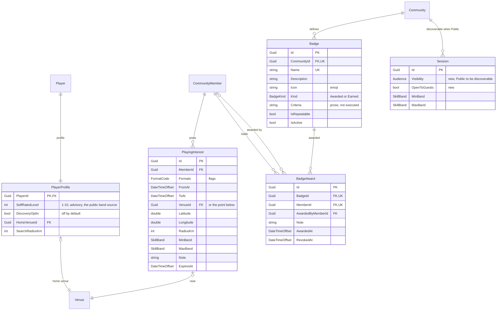

# Discovery and recognition

## Notes

**`Audience` is a new enum, added to `Team`, `Match` and `Session`**: `Private`, `Members`,
`Linked`, `Public`, defaulting to `Members`. `ContactVisibility` is not reused despite the precedent
of `MediaAsset.Visibility` — a match's audience named after contacts reads badly, and `Linked` has
no counterpart there. **`Audience.Linked` is inert**, exactly like `CommunityLink`: nothing consumes
it until a federation protocol exists (issue #42), and it must not be offered in the UI before then.

**`SkillBand` is not the rating.** It is a coarse, self-declared band — beginner, improver,
intermediate, advanced, competitive — derived from `PlayerProfile.SelfRatedLevel` by a pure function
in `Ssabba.Domain`. `CommunityMember.Rating` is comparable only inside its own community
([ADR-0002]()), so it may inform a band *within*
a community and must never be used to rank strangers. This keeps discovery from depending on the
unresolved cross-community rating question (issue #43).

**Discovery is opt-in and instance-local.** Nothing surfaces a player until
`PlayerProfile.DiscoveryOptIn` is set, and no session surfaces unless its `Audience` is `Public`.
Cross-instance search is not modelled here.

**`PlayingInterest` carries a place one of two ways** — a `VenueId`, or a point and a radius — with
a check constraint requiring one of them. It expires, so a stale interest stops matching by itself
rather than by a cleanup job. Combined with `Session.StartsAt` this is what "find a game by time,
place and level" actually queries.

**Every discovery query must consult `Block`**, in both directions, and must exclude soft-deleted
players and sessions. Neither is enforced by the schema — there is no global query filter — so both
belong in the queries and in the tests, alongside the `CommunityId` obligation of issue #44.

**Badges belong to a community.** Unique on `(CommunityId, Name)`; a badge does not travel, for the
same reason a rating does not. `Criteria` is prose for a human, never executed: the first pass
awards by hand, and `BadgeKind.Earned` is reserved for automatic criteria that are deliberately
deferred. A partial unique index on `(BadgeId, MemberId) WHERE RevokedAt IS NULL` allows one live
award per member unless the badge `IsRepeatable`. Revoking keeps the row, so the record shows the
award happened and was withdrawn.
