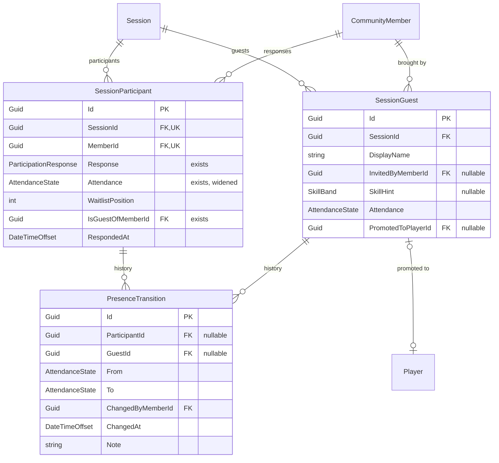
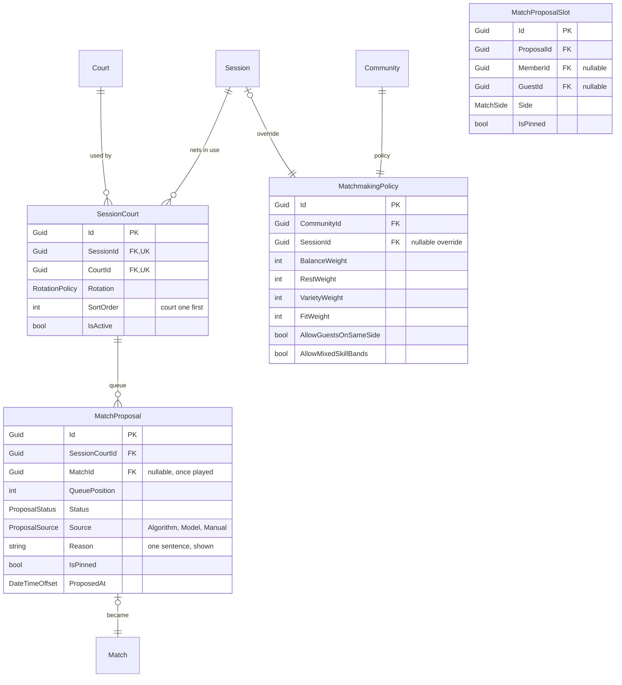
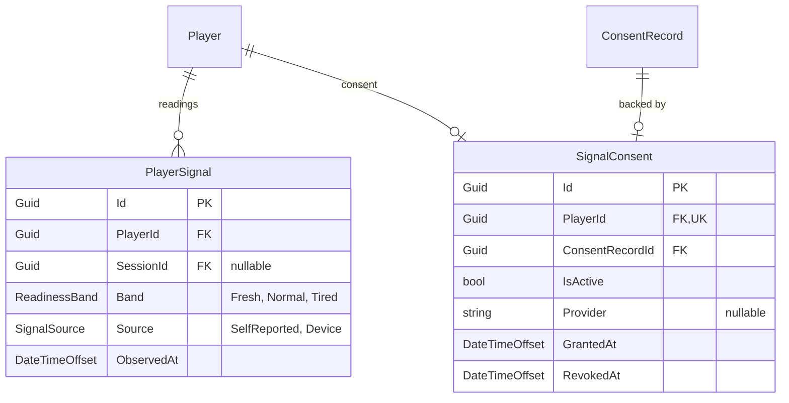

# Game day

The running state of a session: who is on the sand right now, which net they are on, and what the
app proposed. This slice is described in [Game day]() and decided in
[ADR-0004]().

**None of this exists in `src/` yet**, apart from the two fields noted as already present. The
diagrams below are a design, not a description.

## Presence and guests

**`AttendanceState` widens** from `Unknown`, `Present`, `NoShow`, `Excused` to also carry `EnRoute`,
`CheckedIn`, `Paused` and `CheckedOut`. `Present` is kept for sessions typed up afterwards, which
have no timeline to record. Only `CheckedIn` is eligible for a court.

**`PresenceTransition` is the audit trail**, and it is why the state change is not just an update.
`ChangedByMemberId` is the organiser acting for somebody else — the normal case — and a disputed
`NoShow`, which moves `CommunityMember.ReliabilityScore`, is answered from here. It carries exactly
one of `ParticipantId` or `GuestId`; a check constraint enforces that, in preference to the
polymorphic bare `Guid` used for reactions in
[Social and moderation](), because here there are only two
targets and both are real tables.

**`SessionGuest` is not `CommunityMember.Role = Guest`.** It is a name on one session with no
account, no rating and no ladder entry. `PromotedToPlayerId` is set when the guest becomes a real
member; earlier matches stay unrated.

## The board

**A proposal is not a match.** It is a suggestion sitting in a court's queue, with the sentence that
explains it and the source that produced it. It becomes a `Match` only when somebody confirms one —
and many clubs never will, so `MatchId` stays null and the proposal is the only record that four
people played. `IsPinned`, on the proposal and on each slot, is what survives recomputation.

**`MatchmakingPolicy` is per community**, optionally overridden for one session. The weights are the
terms in [Matchmaking](): balance, rest, variety, fit.

**Rotation belongs to the court, not the session.** Court one can run king of the court while court
four runs a social round robin, which is what clubs actually do.

## Signals

**A band and a timestamp, and nothing else.** No raw series, no heart rate, no sleep. `Source`
records which instrument produced it, since a self-report and a device reading are not the same
measurement. Revoking consent deletes the `PlayerSignal` rows, which is why they are cheap and
detachable. The consent itself hangs off the existing `ConsentRecord` machinery in
[Privacy and notifications](). See
[ADR-0005]().

## Tournaments

`Tournament`, `TournamentEntry` and `Match.TournamentId` / `TournamentRound` / `BracketSlot` already
exist and are described in [Matches and ratings](). Game day
adds no tables to them; it adds a `DrawSeed` on `Tournament` so a generated bracket is reproducible,
and reads the rows that have been inert since the first migration.
