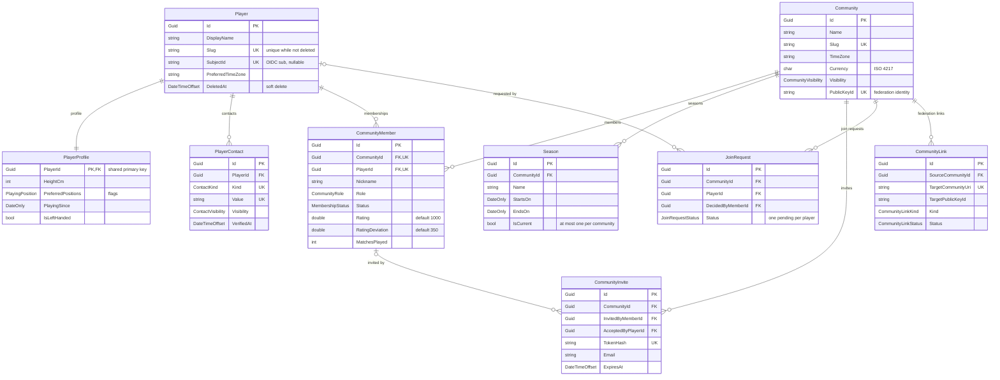

# Identity and communities

## Notes

**Rating lives on the membership, not the player.** `CommunityMember.Rating` and
`RatingDeviation` are per community, so the same person can be a strong player in one group and a
newcomer in another. `Player` carries no rating at all. The index
`(CommunityId, Rating)` exists to serve the ladder.

**A player may exist without an account.** `SubjectId` holds the OIDC `sub` and is nullable, which
lets an organiser record someone who has never signed in. Both `Slug` and `SubjectId` are unique
only among rows where `DeletedAt IS NULL`, so a deleted player does not block reuse.

**Signing in makes you a player.** The first successful sign-in writes a `Player` carrying that
`sub`, with the slug derived from the Keycloak username; where the instance already has a
community, it also adds a `CommunityMember` as `Member`. Later sign-ins find the row and change
nothing. A taken slug is numbered (`chris-2`) rather than refused — nobody may be locked out of
their own first sign-in.

**Signing in never claims a player entered by hand**, even when the names match exactly. Such a
player carries a rating and a match history, and an account nobody has vouched for must not
inherit either by matching a name. Adopting one is a deliberate act, and needs a flow of its own.

**The role authorises, the status gates it.** `CommunityRole` runs Guest, Member, Organizer, Admin,
Owner in that order, so a permission is a comparison rather than a list. `MembershipStatus` is asked
first: a membership that is pending, suspended or left carries no permission at all, whatever its
role says. `Community.AmendWindowMinutes` is the one permission expressed as time rather than as
role — how long somebody who played may go on correcting that result — and a match may override it.

**One profile row per player**, keyed by `PlayerId` itself — a shared primary key, cascading from
`Player`.

**Joining a community** happens by invite (`CommunityInvite`, single-use token hash, expiring) or
by request (`JoinRequest`). A partial unique index on `(CommunityId, PlayerId) WHERE Status = 0`
allows exactly one pending request at a time while keeping the history of decided ones.

**`CommunityLink` is a stub for future federation between instances; nothing consumes it yet.**
It records the address of a community on another instance (`TargetCommunityUri`), the
`PublicKeyId` that identifies it once a handshake confirms the link, the hash of the secret both
sides present, a scope (`SharedTournaments`, `SharedCourts` or `Full`) and a status
(`Proposed → Active`, `Suspended` or `Revoked`). It exists so the identifiers stay stable and the
schema does not need rewriting when federation arrives. See
[Concept]() and
[ADR-0002]().
