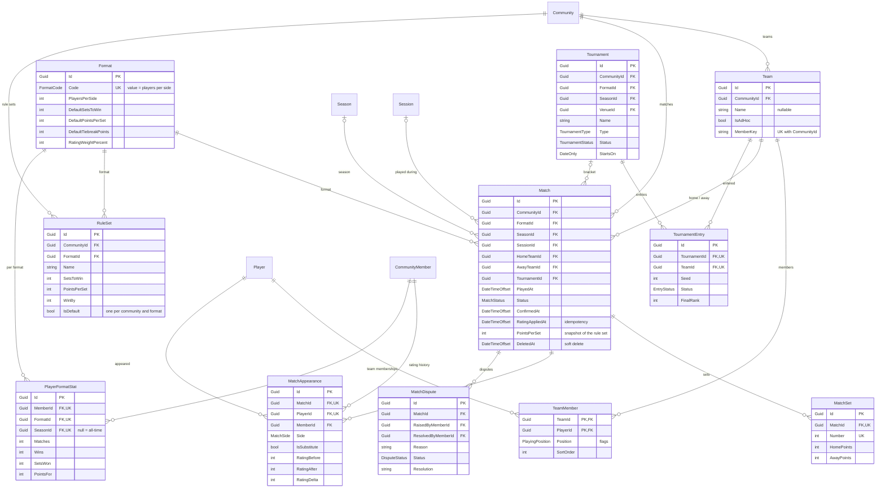

# Matches and ratings

## Notes

**`Format` is seeded reference data** with fixed GUIDs, defined in
`src/Ssabba.Infrastructure/Configurations/Play/FormatConfiguration.cs`: 2v2 through 6v6. Its
`RatingWeightPercent` decides how much a result in that format may move a rating — 100 % for 2v2
down to 50 % for 6v6, because a bigger side dilutes any one player's influence.

**A match copies its scoring rules.** `SetsToWin`, `PointsPerSet`, `WinBy` and `TiebreakPoints` are
stored on `Match` as well as on `RuleSet`. Editing a rule set later must not silently rewrite
history, so the match keeps the snapshot it was played under. `HomeSetsWon`, `AwaySetsWon` and
`Outcome` are computed from `MatchSet` and mapped as `Ignore`d — they are not columns.

**`MatchAppearance` is the rating source of truth.** It records who played, on which side, and what
their rating did (`RatingBefore` / `RatingAfter` / `RatingDelta`, kept explicitly so history
survives a change to the maths). `CommunityMember.Rating` is the running total; the appearances are
the journal it can be rebuilt from. The calculation itself is pure and zero-sum — see
`src/Ssabba.Domain/Rating/MatchRatingCalculator.cs` and
[Rules and scoring]().

**Rating is applied once.** `RatingAppliedAt` is the idempotency marker, and the index
`(CommunityId, Status, RatingAppliedAt)` is the queue a rating worker scans: confirmed matches
whose ratings have not yet been applied. It is cleared as well as set: `ApplyRatingAsync` and
`ReverseRatingAsync` in `src/Ssabba.Web/Endpoints/MatchEndpoints.cs` are a pair, and a match that has
had its rating taken back is a match the queue will pick up again. Correcting a score runs both, in
one transaction, so the ladder ends where entering the right score first would have put it. Neither
is exact once the same players have played again — Elo is path-dependent — so replaying a community's
history is its own job, and these two are what it will be built on.

**A deleted match is struck, not erased.** Deleting sets `DeletedAt` and `MatchStatus.Voided` and
gives back the rating; the row and its history stay. A result that vanished could not explain a
rating that had already moved, and the appearances are the journal the ladder is rebuilt from. Every
read filters on `DeletedAt` rather than expecting the row to be gone.

**A score is checked before it is stored.** `MatchScoring.Validate` in `Ssabba.Domain` refuses a set
nobody won, a set stopped short of its target, a margin the rules do not allow, and a set played
after the match was already decided — each against the match's own snapshot rather than against the
current rule set. The same function runs in the entry form and behind the API, so a bad score is
caught before it is posted and again if it arrives anyway. The rules themselves are written down once,
in [Rules and scoring]().

**Teams are cheap, but a lineup is only ever one of them.** `IsAdHoc` marks the throwaway pairings
formed for a single evening, as opposed to standing teams that enter tournaments. `TeamMember` is a
true join table with a composite key, the only N:M between players and teams.

`MemberKey` is the natural key the lineup never had: the members' ids, sorted and joined, unique
within the community (`TeamRoster.Key`). Forming a team looks it up first, so the same pair entered
again — in either order, from the teams page or from a phone at the net — comes back as the team it
already is rather than as a second row. Naming such a pairing promotes it in place. That is why
duplicates are resolved by reuse rather than by an error: at the net, being told "that team exists"
is useless, and being handed the team is what was meant.

**Deletes are restricted where the ladder depends on them**: `HomeTeam`, `AwayTeam` and `Format`
cannot be removed while matches reference them, whereas `Season`, `Session` and `Court` are
`SetNull` — losing the context does not invalidate the result.

`PlayerFormatStat` is a derived rollup, not a fact. Two partial unique indexes keep one row per
member and format per season and one more for all-time, where `SeasonId IS NULL`.
