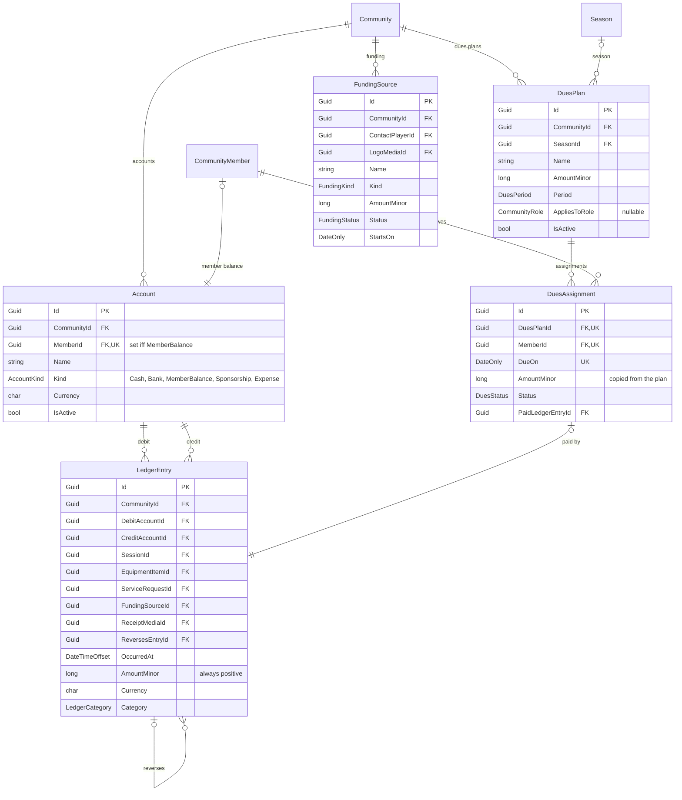
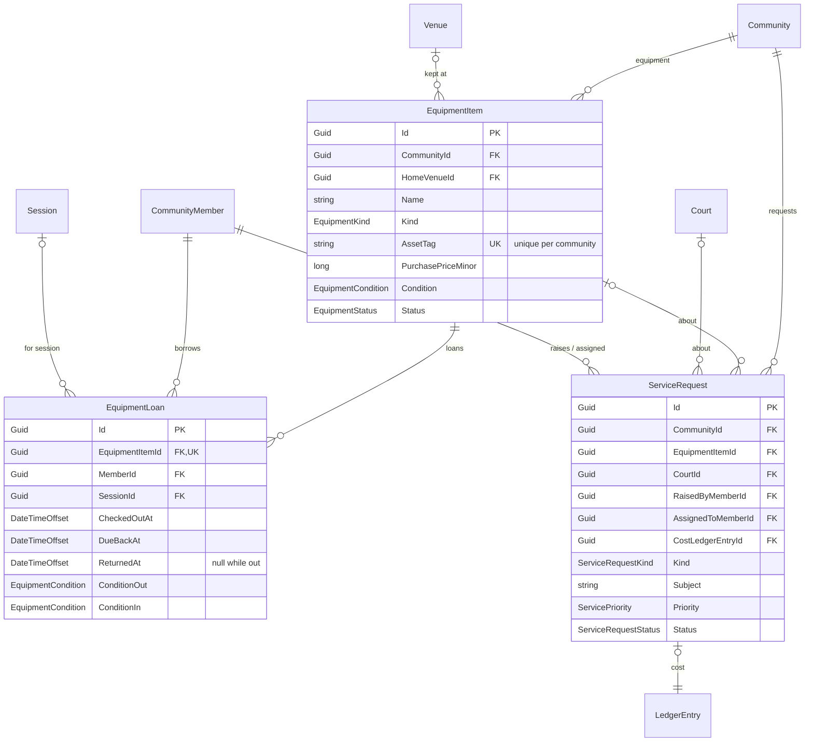

# Operations and money

Communities buy balls, rent courts and collect dues. Ssabba books all of it through a double-entry
ledger so a balance is always the sum of entries rather than a number someone edited.

## Notes

**Amounts are always positive** (`CK_LedgerEntries_AmountPositive`) and direction is carried by
which account is debited and which credited — the two must differ
(`CK_LedgerEntries_DistinctAccounts`). Corrections are made by booking a reversing entry that points
at the original through `ReversesEntryId`; nothing is edited or deleted. Both account references are
`Restrict`: an account with entries against it cannot be removed out from under the books.

**A member's balance is an account.** `CK_Accounts_MemberBalanceHasMember` enforces the biconditional
`(Kind = MemberBalance) = (MemberId IS NOT NULL)`, and a partial unique index gives each member at
most one.

**Optional context, never required.** `SessionId`, `EquipmentItemId`, `ServiceRequestId`,
`FundingSourceId` and `ReceiptMediaId` are all `SetNull`. Deleting a session must not delete the
money booked against it — the entry simply loses its context.

**Dues are generated, then tracked.** A `DuesPlan` describes what is owed and how often; a
`DuesAssignment` is one concrete instalment for one member, unique on
`(DuesPlanId, MemberId, DueOn)` so regeneration is safe. It copies `AmountMinor` from the plan for
the same reason a match copies its scoring rules, and links to the `LedgerEntry` that settled it.

## Equipment and service

An item can only be out once: a partial unique index on `EquipmentItemId WHERE ReturnedAt IS NULL`
makes a second checkout impossible until the first is returned, and
`CK_EquipmentLoans_ReturnedAfterCheckout` keeps the dates sane. Recording condition on the way out
and on the way back is what turns a loan into evidence when something comes back broken —
`ServiceRequest` then carries the repair, and its cost points at the ledger entry that paid for it.
