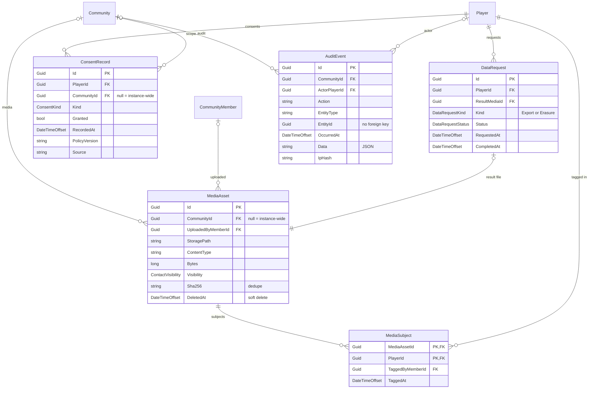
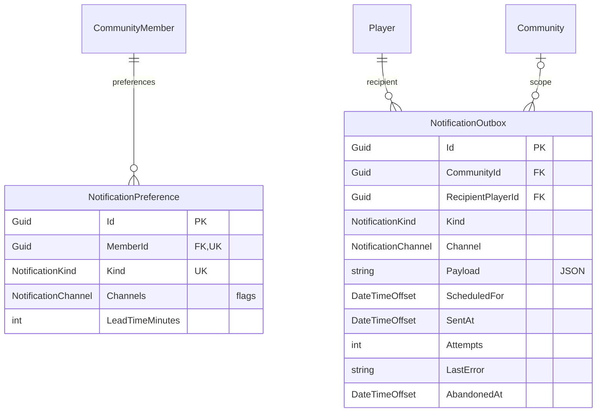

# Privacy and notifications

## Notes

**Consent is append-only.** A `ConsentRecord` is never updated; withdrawing consent writes a new row
with `Granted = false`. The current state is the newest row for that player and kind, which the
index `(PlayerId, Kind, RecordedAt)` serves. `PolicyVersion` records which text was agreed to, so a
policy change can be detected rather than assumed.

**`AuditEvent.EntityId` deliberately has no foreign key.** The audit log has to outlive the rows it
describes — otherwise deleting a record would erase the evidence that it was deleted. `EntityType`
plus `EntityId` is a loose reference, indexed as a pair. `IpHash` stores a hash, never an address.

**Media is deduplicated by content.** `Sha256` is indexed where not null, so the same photo uploaded
twice can be stored once. Tagging a person in a photo (`MediaSubject`) is a composite-key join, and
it is what a data export or erasure request has to walk to find every image someone appears in.

## Notifications

`NotificationOutbox` is a transactional outbox: a notification is written in the same transaction as
the change that caused it, and a sender picks it up afterwards. The partial index
`IX_NotificationOutbox_Pending` on `ScheduledFor WHERE SentAt IS NULL AND AbandonedAt IS NULL` keeps
that poll cheap no matter how much history accumulates. Repeated failures raise `Attempts` and
record `LastError`; `AbandonedAt` retires a message that will never send.

Preferences are per membership and per kind, with `Channels` a flags enum, so one row says "remind me
about sessions by email and push, two hours ahead".
