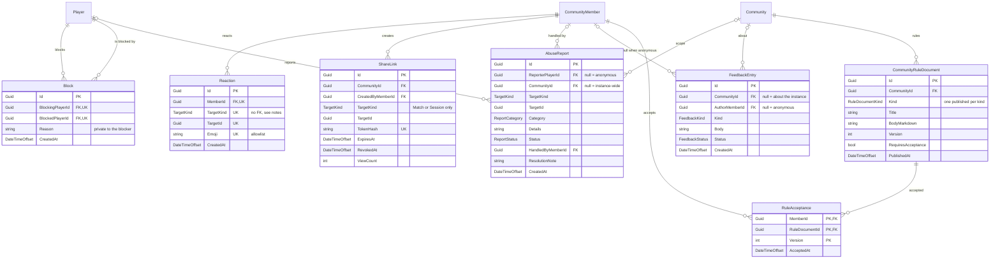

# Social and moderation

## Notes

**Targets are polymorphic, and the database cannot help.** `Reaction`, `ShareLink` and
`AbuseReport` identify what they point at with a `TargetKind` enum (`Match`, `Session`,
`MediaAsset`, `Poll`, `Player`, `Community`) plus a bare `Guid`. There is **no foreign key**, so
there is no cascade: deleting or soft-deleting a match must explicitly remove its reactions and
revoke its share links, and queries must exclude reactions whose target is soft-deleted. This is the
one place the conventions on [this section's index]() are knowingly broken; the
alternatives, and why they cost more, are weighed in
[ADR-0003]().

**A like is a reaction.** There is no separate entity. The unique index on
`(MemberId, TargetKind, TargetId, Emoji)` makes reacting idempotent — a second identical reaction is
a removal, not a second row — while still allowing one member several different emoji on one thing.

**`ShareLink` mirrors `CommunityInvite`.** A single-use-shaped token whose **hash** alone is stored,
an expiry, and a revocation. It grants a read-only view of one match or session and nothing else.
`TargetKind` is constrained to those two by a check constraint, since the schema cannot express it
any other way.

**Blocking is between players, not memberships**, and therefore instance-wide: `CommunityMember` is
scoped to a community and the harm a block answers to is not. Unique on
`(BlockingPlayerId, BlockedPlayerId)`; the reverse pair is a separate row, because a block is
one-directional as a statement even though its effect is felt both ways. **A block never touches
`Match`, `MatchAppearance` or `CommunityMember.Rating`** — the ladder is a record of games played,
and no query may rewrite it.

**Reports are not disputes.** `MatchDispute` keeps its own table and its own queue for "that score
is wrong". `AbuseReport` is for "that person"; `ReportStatus` deliberately mirrors `DisputeStatus`
(`Open`, `Triaged`, `Actioned`, `Rejected`, `Withdrawn`) so the two read alike.

**Anonymity is structural.** A null `ReporterPlayerId` or `AuthorMemberId` is the *only* record of
authorship, and no `AuditEvent` is written for an anonymous submission — which means suppressing
behaviour that happens everywhere else. Such rows are consequently out of reach of a `DataRequest`
erasure: there is no `PlayerId` to match. That is intended, and belongs in the privacy notice.

**Rule documents are versioned, acceptance is per version.** A partial unique index gives one
published document per community and kind; `RuleAcceptance` has a composite key of member, document
and version, so amending a document re-asks rather than silently carrying the old agreement forward.
Kept apart from `ConsentRecord` on purpose: consent is about data, acceptance is about conduct. See
[Privacy and notifications]().
