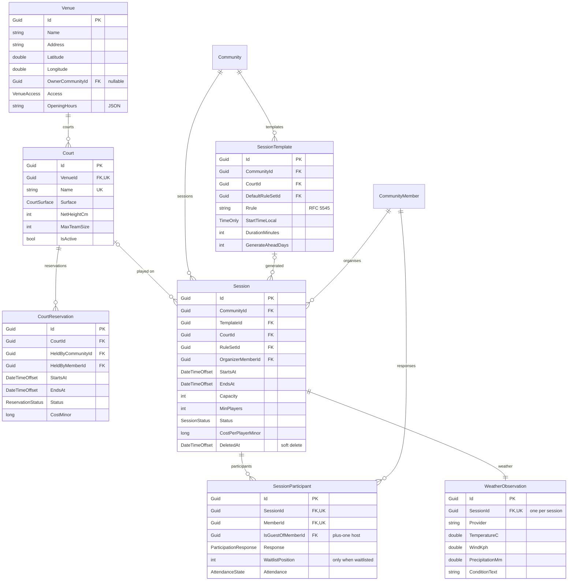
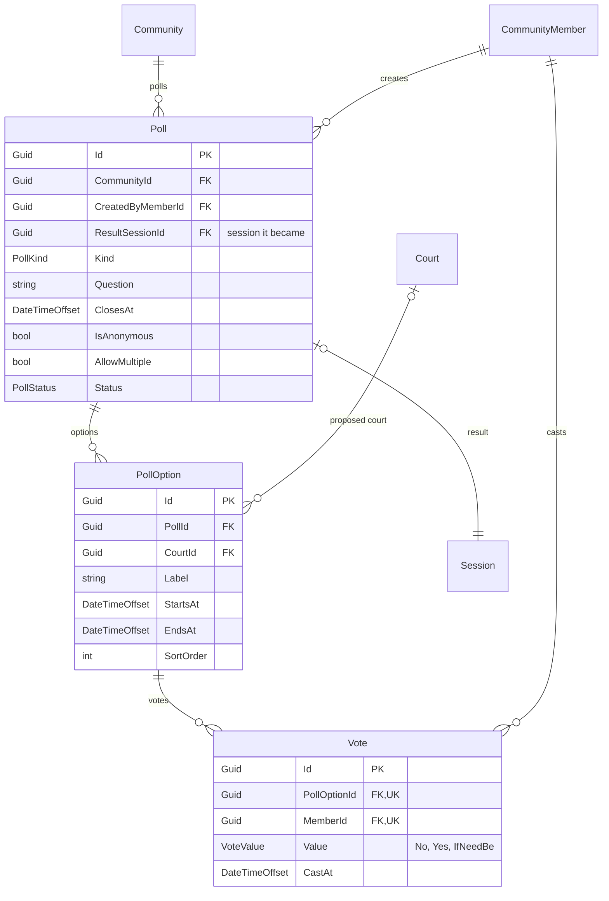

# Venues and sessions

A session is a scheduled meet-up: a time, a court, a capacity and a list of who is coming.

## Notes

**Courts cannot be double-booked.** `CourtReservation` carries a GiST exclusion constraint,
`EX_CourtReservations_NoOverlap`, which rejects any confirmed reservation whose
`tstzrange(StartsAt, EndsAt, '[)')` overlaps another on the same court. It only applies to
`Status = 0`, so cancelled reservations stay on record without blocking the slot. This needs the
`btree_gist` extension, created by the initial migration. A `CK_CourtReservations_EndsAfterStart`
check backs it up, and `Session` carries the equivalent `CK_Sessions_EndsAfterStart`.

**Recurring sessions** come from a `SessionTemplate` holding an RFC 5545 `Rrule`. Generated
occurrences are unique on `(TemplateId, StartsAt)` — a partial index, so ad-hoc sessions with no
template are unconstrained — which makes generation idempotent.

**The waitlist is explicit.** `WaitlistPosition` may only be set when `Response` is the waitlisted
value, enforced by `CK_SessionParticipants_WaitlistPosition`. `IsGuestOfMemberId` points at another
member of the same community and models plus-ones: the guest occupies a slot but the member who
brought them is recorded.

**Weather** is fetched once per session and cached; the unique `SessionId` makes it a genuine
zero-or-one relationship.

## Polls

Polls pick a date or settle a question. Votes are cast per option, so an approval-style poll is a
set of yes/no/if-need-be answers rather than a single choice.

The unique `(PollOptionId, MemberId)` pair means one answer per member per option; changing a vote
updates the row rather than adding one. When a date poll resolves, `ResultSessionId` links the poll
to the session it produced.
