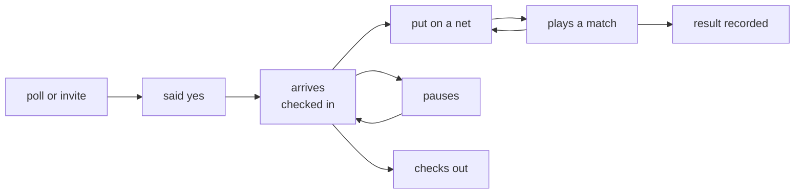

# Game day

The [Concept]() describes what Ssabba stores and who owns it, and
[Experience]() describes the surfaces a member meets. This section
describes the two hours in the middle: the evening itself, from the first person arriving to the
last set being written down.

Everything else in Ssabba is administration around an event. This is the event. People trickle in
over an hour, some who said yes never come, some who said nothing turn up anyway, somebody brings a
friend, and one person has to keep deciding who plays whom on which net — over and over, until the
light goes. The ambition here is modest and specific: **make that person's job easier without ever
taking the decision away from them.**

## The evening as a loop

Two things about that loop shape everything in this section.

**What somebody promised and where they are now are different facts.** `SessionParticipant` already
keeps both — `Response` for the promise, `Attendance` for what happened — and the gap between them
is what no-show tracking is. Game day widens the second one from a verdict written afterwards
(`Present`, `NoShow`) into a state that moves during the evening. See
[Presence]().

**The organiser acts for other people constantly.** Phones stay in bags, batteries die, and half the
group would not open an app on the beach even if they could. Every state change must be performable
by the organiser on somebody else's behalf, and the app must be usable by a group where only one
person is holding it. A design that assumes fifty people all self-service is a design for a
different sport.

## What this is not

- **It is not a referee.** Ssabba never decides that a match is over, never counts points live, and
  never enforces a rotation. It proposes and records.
- **It is not a queue-management tyrant.** Court assignments are suggestions on a board. The
  organiser drags, pins, swaps and ignores them, and the app does not argue.
- **It is not a training platform.** Fitness signals from a watch, where they exist at all, are one
  small optional term in a team suggestion — never a report card, and never visible to the group.
  See [Signals]().
- **It is not automatic.** There is no mode where the app runs the evening. Nothing is written to a
  match without a person confirming it.

## The size of the problem

The design target is deliberately larger than a normal Tuesday: **five nets and fifty players**,
with people arriving and leaving throughout. That number is what forces the shape — a board rather
than a list, proposals rather than manual pairing, and a check-in that takes one tap. A club of
twelve gets the same screens and never notices most of them.

## Pages

- **[Presence]()** — from the poll to check-out, and who is allowed to move
  somebody else through it.
- **[Guests]()** — playing without an account, and what a guest costs the
  rating.
- **[Courts and rotation]()** — nets as a running resource, the queue, and
  the organiser's board.
- **[Matchmaking]()** — how teams get suggested, the community's own
  fairness knobs, and the optional local model.
- **[Tournaments]()** — a bracket thrown together in five minutes, and
  one planned for months.
- **[Signals]()** — wearables, consent, and why the signal stays coarse.

The decisions and what was weighed against what are in
[ADR-0004]() and
[ADR-0005](). The schema shape is in
[Game day]().
