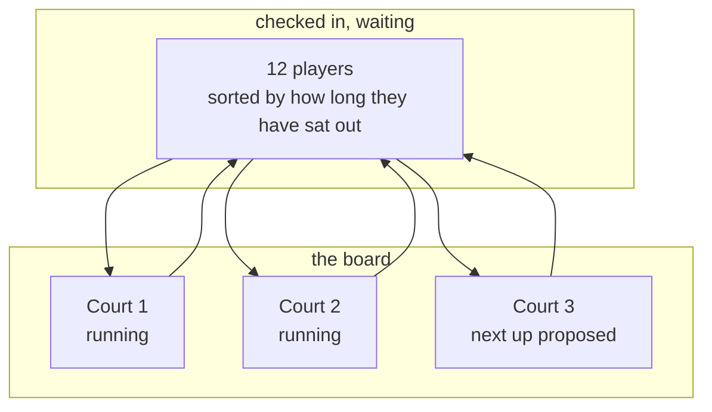

# Courts and rotation

`Venue`, `Court` and `CourtReservation` already describe which nets exist and who booked them.
What none of them describes is the running evening: which net is playing right now, who is next on
it, and who has been sitting on the sand for forty minutes.

## The board

The organiser's screen is a column per court, not a list of matches.

Each court holds at most one running match and a short queue of proposed ones. Finishing a match
returns its players to the pool and pulls the next proposal up. That is the whole mechanism.

The pool is ordered by **how long somebody has waited**, not by rating. On a busy evening the single
loudest complaint is not "the teams were uneven", it is "I have played twice and he has played six
times". Rest is therefore a first-class input to [matchmaking](), and
the board shows waiting time plainly so the organiser can see the unfairness the app is trying to
prevent.

## Rotation is a policy, not a law

A community plays the way it plays. The policy is chosen per session, and the app follows it when it
proposes:

- **`WinnerStays`** — the winning pair holds the court, challengers come off the pool. The classic
  beach arrangement, and brutal on newcomers unless the pool ordering pushes back.
- **`RoundRobin`** — everybody rotates through, balanced across courts.
- **`KingOfTheCourt`** — as `TournamentType.KingOfTheCourt` already describes: winners climb towards
  court one, losers drop.
- **`Manual`** — no proposals. Some organisers know their group better than any weighting will, and
  the app should get out of the way completely rather than badly.

The policy shapes suggestions. It never moves anybody by itself: **the app proposes, the organiser
disposes.** Every proposal can be swapped, pinned, reordered or thrown away, and a manual change is
never silently undone by the next recomputation.

## Written down or not

There is a fork the app must not force. Some clubs record every set; some play forty matches in an
evening and record none of them. A proposal that reaches a court and is played can end as a
recorded `Match` with sets, or as nothing at all beyond "these four played, that long". Requiring a
scoreline before the next match can start would turn the board into a burden and get it abandoned by
exactly the busy evening it was built for.

## What running it at size costs

Five nets and fifty players is the sizing target, and it is what makes this hard rather than
tedious:

- **Recomputing proposals must be quick.** Every finished match reshuffles a pool of thirty-odd
  people across three free courts. This is a combinatorial problem with a good-enough answer, and
  the good-enough answer must arrive fast enough to feel instant, or the organiser will stop asking
  for it.
- **The device is a phone, outdoors, in sun, with sand on it.** One thumb, large targets, high
  contrast, and no assumption that a fifty-person board fits on a screen.
- **The network is a beach.** The board must survive a dead connection: actions queue and reconcile,
  and nothing is lost because the signal went. This is the strongest pull towards keeping real state
  on the client that Ssabba has yet had, and it is why the board is the first genuine use of
  `Ssabba.Web.Client`.
- **Several people may be holding the board.** Two organisers on two phones must not produce two
  different court ones. Conflicts resolve last-write-wins per court, and the board shows what
  changed rather than merging silently.

Design is [ADR-0004]().
