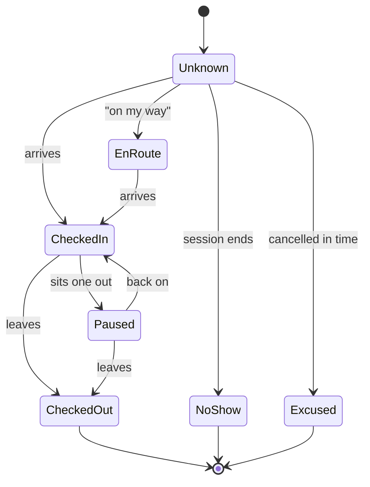

# Presence

A person's relationship to one session has two independent facts attached to it, and confusing them
is the mistake this page exists to prevent.

| Axis | Field | Answers |
| --- | --- | --- |
| **Commitment** | `SessionParticipant.Response` | What they said in advance: `No`, `Maybe`, `Yes`, `Waitlisted` |
| **Presence** | `SessionParticipant.Attendance` | Where they are now, and how the evening ended for them |

Both already exist. `Response` needs nothing new. `Attendance` today is a verdict written after the
fact — `Unknown`, `Present`, `NoShow`, `Excused` — and game day needs it to be a state that moves
while the evening runs.

## The states

- **`Unknown`** — nothing recorded. The default, and the state most people are in an hour before
  the whistle.
- **`EnRoute`** — said they are coming, not here yet. Purely advisory and always optional: it lets
  an organiser hold a slot for the person stuck in traffic instead of giving it away.
- **`CheckedIn`** — here, and available to play. **This is the only state that makes somebody
  eligible for a team.**
- **`Paused`** — here, not playing. Resting, refereeing, eating chips. They keep their place in the
  session and drop out of team proposals until they come back.
- **`CheckedOut`** — gone. Their slot is released to the waiting list, and they stop appearing in
  proposals. Whatever they already played still counts.
- **`NoShow`** — committed and did not appear. The only state that counts against
  `CommunityMember.ReliabilityScore`.
- **`Excused`** — cancelled in good time. Explicitly does not count against reliability.

`Present` is retained as the value meaning "was here, nothing finer recorded", so that sessions
entered after the fact — the normal case for a club typing up last Tuesday — do not have to pretend
to a timeline they never captured.

## Somebody else's hands

**Every transition can be performed by an organiser for another person.** This is not a fallback for
an unusual case; on a beach it is how most rows get written. Somebody forgot their phone, somebody
has no account at all, somebody is on court and cannot be asked.

The consequence is that a presence change is not self-evidently truthful, so it records who made it:
the acting member and a timestamp. That trail is what lets a disputed `NoShow` be answered, and it
is why the audit sits on the transition rather than on the participant row — the row only knows the
current state, and the argument is always about how it got there.

An organiser marking somebody `NoShow` is a claim about a person that touches their reliability
score. It stays reversible, and a session that has ended does not freeze it.

## What presence never does

- **It never rewrites a match.** Somebody who played two sets and then checked out played two sets.
  `MatchAppearance` rows and the ratings they carry are a factual record; presence is a fact about
  the evening, and the two do not edit each other.
- **It never removes somebody from a running match.** Checking out mid-set finishes the set. The
  board stops proposing them; it does not void what is on the sand.
- **It is not a location.** Nothing tracks where anybody is. `EnRoute` is a self-declared word, not
  a GPS fix, and there is no arrival time estimated from anything.

## Walk-ins and the waiting list

A person can enter the evening at `CheckedIn` with no `Response` at all — no poll answer, no
registration, just standing there. That is a normal Tuesday, and the app must not make it awkward:
adding a checked-in member takes one action from the board.

That interacts with capacity. `Session.Capacity` and `WaitlistPosition` describe intent, not the
beach. When a session is full and three of the people holding slots have not appeared, the organiser
needs to be able to promote from the waiting list without first pretending the absent three
cancelled. The rule is that **presence beats commitment on the day**: `CheckedOut` and `NoShow`
release a slot, and the app offers the next waiting person rather than taking them.

Capacity is a soft ceiling anyway; five nets take twenty on court and everybody else is queueing.
What actually limits an evening is [courts](), not the participant list.

Design is [ADR-0004](); the schema is in
[Game day]().
